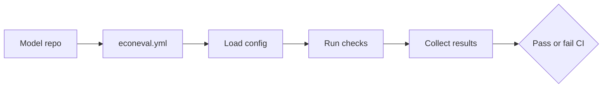

# EconEval

pytest for economic logic.

<p align="left">
  
</p>

[](https://pypi.org/project/econeval/)
[](https://github.com/Farukhsb/econeval/actions/workflows/ci.yml)
[](https://github.com/Farukhsb/econeval/actions/workflows/ci.yml)
[](https://www.python.org/)
[](https://github.com/Farukhsb/econeval/releases/tag/v0.5.0)

EconEval is a small open-source framework for pytest-style checks on economic logic in CI.

It catches problems unit tests often miss: broken rules, drift after data changes, and outputs that stop making economic sense.

Latest release: [`v0.5.0`](https://github.com/Farukhsb/econeval/releases/tag/v0.5.0)

## What It Does

EconEval currently does three things:

- loads a model check config
- runs invariant tests against a Python object
- writes JSON, JUnit, Markdown, or HTML reports that CI can keep or fail on

The config layer is validated with Pydantic, and invariant evaluation uses a static AST pre-check plus a numeric `numexpr` fast path for safe math-heavy expressions.

Use it to:

- check that important economic rules still hold
- making model assumptions explicit in code
- failing pull requests when a change breaks a rule you care about

## Maturity

The invariant engine, CLI, reports, examples, and GitHub Action are usable today.
The R, Stata, and Julia bridge helpers are also available for teams that want to call the CLI from other ecosystems.

The broader checks are still evolving:

- stress testing
- fairness checks
- drift checks
- PDF reports

That split is intentional: the core is meant to be small, auditable, and easy to run in CI.

## Who Should Use This

EconEval is for people who want a lightweight, CI-native way to check whether a model still makes economic sense. The core stays close to unit-test style validation; the broader checks are extensions on top of that.

- academic economists validating research code and replication projects
- policy analysts checking that a model still respects program rules and constraints
- quantitative consultants delivering models to clients with auditability requirements
- teams working on forecasting, scenario analysis, or simulation pipelines
- researchers who want a lightweight validation layer before a model is published or deployed
- applied data scientists building models that need economics-aware guardrails
- analysts who want CI checks they can explain in a report or appendix

## Why It Exists

Traditional software tests are useful, but they do not tell you whether a model still behaves like a valid model.

For example, a change might:

- flip the sign of an elasticity
- violate a market-clearing condition
- break a policy constraint
- quietly change the meaning of a downstream output

EconEval gives you a place to encode those rules and run them automatically.

## Current MVP

The first usable version of EconEval does three things well:

1. read a simple YAML config
2. evaluate invariant expressions against a model object
3. return a clear pass or fail result that GitHub Actions can use

That is enough to support a real workflow without pretending to solve every validation problem at once.

## 60-Second Demo

Run a passing elasticity check:

```bash
econeval --config examples/basic_model/econeval.yml --model examples/basic_model/model.py --class DemoModel --report out/pass.json
```

The rule is `model.elasticity < 0`, and `DemoModel` passes because its elasticity is negative.

Run the same rule against a failing model:

```bash
econeval --config examples/broken_model/econeval.yml --model examples/broken_model/model.py --class BrokenModel --report out/fail.json
```

`BrokenModel` fails because its elasticity is positive.

## Example Config

```yaml
project: demo-model
version: 1

invariants:
  - name: elasticity_must_be_negative
    expression: model.elasticity < 0
  - name: supply_must_be_non_negative
    expression: model.supply >= 0

stress_tests:
  - name: stagflation_shock
    dataset: data/stagflation.csv
    metric: mape
    threshold: 0.15

  - name: macro_stagflation
    kind: synthetic
    metric: invariants
    manipulations:
      - variable: input_data.unemployment_rate
        action: add
        value: 0.04
      - variable: input_data.energy_costs
        action: multiply
        value: 1.5
    invariants:
      - name: slowdown_flag
        expression: model.predicted_gdp_growth < 0.01

fairness:
  enabled: true
  metrics:
    - demographic_parity_difference
    - disparate_impact_ratio
    - gini
    - atkinson
    - equal_opportunity_difference
    - equalized_odds_difference
```

## How It Fits Together



## Project Layout

```text
econeval/
  .pre-commit-config.yaml
  .github/
    workflows/
      ci.yml
  action.yml
  bridges/
    julia/
      econeval_bridge.jl
    r/
      econeval_bridge.R
    stata/
      econeval_bridge.do
  scripts/
    precommit_econeval.py
  examples/
    basic_model/
      model.py
      econeval.yml
    csv_model/
      README.md
      econeval.yml
    drift_model/
      model.py
      econeval.yml
    fairness_model/
      README.md
      model.py
      econeval.yml
    broken_model/
      model.py
      econeval.yml
    policy_model/
      model.py
      econeval.yml
    advanced_model/
      model.py
      econeval.yml
  src/
    econeval/
      __init__.py
      cli.py
      config.py
      invariants.py
      traceability.py
      scenarios.py
      reporting.py
  tests/
    test_config.py
    test_invariants.py
```

## Install

For development from a checkout:

```bash
git clone https://github.com/Farukhsb/econeval.git
cd econeval
pip install -e .[dev]
```

`pytest` and `ruff` are included in the `dev` extra. Install without the extra if you only want the CLI.

If you want the repo-local pre-commit hook that runs EconEval on the basic example, install the hooks once:

```bash
pre-commit install
```

EconEval parses its YAML-like config format with its own loader, so you do not need `PyYAML` for the current release.

For a public release install from PyPI:

```bash
pip install econeval==0.5.0
```

If you want the exact release state, install from the tagged GitHub release:

```bash
pip install git+https://github.com/Farukhsb/econeval.git@v0.5.0
```

If you want to inspect the release artifacts first, start from the `v0.5.0` tag or the GitHub release page.

## Getting Started

1. Install the package with `pip install econeval` or `pip install -e .[dev]` from a checkout.
2. Run the basic example config.
3. Check the generated report and try the broken example next.

Example:

```bash
econeval --config examples/basic_model/econeval.yml --model examples/basic_model/model.py --class DemoModel --report econeval-report.json
```

If you want a quick sanity check, run the broken example next and confirm it fails.

## Benchmarks

To compare the large-array expression backends, run:

```bash
python benchmarks/numexpr_benchmark.py --size 100000 --iterations 20
```

## How To Use It

Create a config file that lists the checks you want to enforce, then point EconEval at a Python model class.

Command line example:

```bash
econeval --config examples/basic_model/econeval.yml --model examples/basic_model/model.py --class DemoModel --report econeval-report.json
```

`python -m econeval` works the same way. For iterative development, `--watch` reruns the checks when the config or model file changes:

```bash
econeval --watch --config examples/basic_model/econeval.yml --model examples/basic_model/model.py --class DemoModel --report econeval-report.json
```

For extra traceability on failed invariants, add `--blame`. EconEval will try to run
`git blame` on the model lines that look related to the failure and include the
commit metadata in the report.

```bash
econeval --blame --config examples/basic_model/econeval.yml --model examples/basic_model/model.py --class DemoModel --report econeval-report.json
```

For model-less CSV relation checks, you can omit `--model` when the config only contains `kind: relation` stress tests:

```bash
econeval --config examples/csv_model/econeval.yml --report econeval-report.json
```

To compare a current run against a previous JSON report, pass `--baseline-report`:

```bash
econeval --config examples/basic_model/econeval.yml --model examples/basic_model/model.py --class DemoModel --report econeval-report.json --baseline-report baseline-report.json
```

To write a text report instead:

```bash
econeval --config examples/advanced_model/econeval.yml --model examples/advanced_model/model.py --class AdvancedModel --report econeval-report.md --format markdown
econeval --config examples/advanced_model/econeval.yml --model examples/advanced_model/model.py --class AdvancedModel --report econeval-report.html --format html
```

To write a PDF report, install the optional extra first:

```bash
pip install econeval[pdf]
econeval --config examples/advanced_model/econeval.yml --model examples/advanced_model/model.py --class AdvancedModel --report econeval-report.pdf --format pdf
```

If you need a custom economic check kind, register a handler in Python and then
use that `kind` in your config:

```python
from econeval.config import EconomicCheck
from econeval.scenarios import register_economic_check_handler

def run_custom_check(model, check):
    return check.name, check.kind

register_economic_check_handler("custom_policy_check", run_custom_check)
```

## GitHub Action

The repository also exposes a composite GitHub Action so workflows can run EconEval in one step.

```yaml
- uses: Farukhsb/econeval@v1
  with:
    config: examples/basic_model/econeval.yml
    model: examples/basic_model/model.py
    class: DemoModel
    report: econeval-report.json
    python-version: "3.11"
```

The action installs the package from the action source, sets up Python, and runs the CLI with the inputs you provide.

## Fairness Checks

Fairness checks are available, but they are still an extension rather than the core path.

They expect a tabular dataset with:

- a group column, defaulting to `group`
- one or more feature columns that are passed to `predict(features)`
- an `actual` column when you use label-based metrics such as `equal_opportunity_difference` or `equalized_odds_difference`

The example in [examples/fairness_model/README.md](examples/fairness_model/README.md) shows the full data format.

The built-in thresholds are:

- `demographic_parity_difference`: pass at `<= 0.2`
- `disparate_impact_ratio`: pass at `>= 0.8`
- `equal_opportunity_difference`: pass at `<= 0.2`
- `equalized_odds_difference`: pass at `<= 0.2`
- `gini`: pass at `<= 0.3`
- `atkinson`: pass at `<= 0.2`

Fairness results also include a `severity` field:

- `pass` for checks within the threshold
- `warn` for borderline misses that should not fail CI
- `fail` for clear misses or execution errors

To run the full advanced example with synthetic shocks, drift checks, fairness metrics, and scan checks:

```bash
econeval --config examples/advanced_model/econeval.yml --model examples/advanced_model/model.py --class AdvancedModel --report artifacts/advanced-report.md --format markdown
```

What the runner expects:

- a model file that defines a class you can import by name
- a `predict(features)` method for stress tests, drift checks, and fairness checks
- CSV datasets with an `actual` column for stress tests
- CSV datasets with the feature or group columns required by the check

EconEval can also adapt common tabular estimators directly when they expose feature metadata such as `feature_names_in_` or `exog_names`.

If your runtime looks different, use a thin adapter. EconEval also handles common shapes like callable models, `solve()` wrappers, and PyMC-style posterior predictive samplers, so you can bridge external engines without rewriting the check pipeline.

Example invariant rule:

```yaml
- name: elasticity_must_be_negative
  expression: model.elasticity < 0
```

If the expression returns `False`, the invariant fails.

The JSON report includes the project name, a summary count, and the result of each invariant, economic check, stress test, drift check, economic drift check, fairness check, and optional baseline comparison block.

## Expression Engine

EconEval uses a restricted invariant engine with a static AST pre-check.

The supported path is intentionally narrow:

- comparisons, boolean logic, simple arithmetic, and attribute access on the model object
- numeric/vectorized expressions through `numexpr` when the expression is safe for that backend

It rejects function calls, subscripts, comprehensions, lambdas, dictionaries, sets, tuples, lists, and private attributes such as `__class__`.

That design keeps the syntax simple for users while avoiding raw `eval()` and other arbitrary Python execution paths.

## Expression Engine Philosophy

The expression layer is intentionally not a general Python runtime.

That is a design choice:

- keep invariant checks auditable
- make failures easier to explain in CI
- avoid hidden side effects and sandbox escape risks
- keep the supported syntax small enough that users can reason about it quickly

The practical rule is simple: if a check needs full Python, put that logic in code, not in the expression string. The expression engine is meant for declarative rules, not imperative workflows.

## Examples

- `examples/basic_model` shows the happy path.
- `examples/csv_model` shows model-less CSV relation checks.
- `examples/broken_model` shows a model and dataset that fail the checks.
- `examples/drift_model` focuses on drift validation, including PSI, trend drift, and regression drift over time.
- `examples/fairness_model` focuses on fairness checks and a simple stress test.
- `examples/policy_model` is a compact policy example with fairness, invariants, and a monotonicity check.
- `examples/advanced_model` shows accounting identities, monotonicity, convergence, grid sweeps, synthetic shocks, and GitHub-friendly report output.
- `--baseline-report` compares a current report against a prior JSON run and highlights regressions, improvements, and new or removed checks.
- `examples/demo_notebook.ipynb` is a short walkthrough you can open in Jupyter or VS Code.
- The repository examples are intended to double as a lightweight demo workflow.

## Non-Python Bridges

The first bridge helper is a thin R wrapper in [bridges/r/econeval_bridge.R](bridges/r/econeval_bridge.R).

It shells out to the EconEval CLI, so R users can keep their own model code in R and still run EconEval checks as part of a CI job or local script.

There is also a Stata wrapper in [bridges/stata/econeval_bridge.do](bridges/stata/econeval_bridge.do).

There is also a Julia wrapper in [bridges/julia/econeval_bridge.jl](bridges/julia/econeval_bridge.jl).

## Roadmap

- richer traceability and failure explanations
- deeper drift comparison and alerting
- richer fairness configuration and reporting
- more real-world examples and benchmark coverage
- deeper interop with tools like `PyMC`, `GAMS`, and Julia
- optional `statsmodels`-based drift helper via `econeval[stats]`
- dashboard polish with filtering and collapsible drill-downs

## Release Flow

Publishing a GitHub Release triggers the release workflow in [`.github/workflows/release.yml`](.github/workflows/release.yml).

That workflow:

- installs the package
- runs the test suite
- runs EconEval against the example model
- uploads a release report artifact

## Next Step

- a richer report viewer
- more scenario types
- baseline trend summaries over multiple releases

## Release Checklist

When you are ready to publish a new version:

1. run the test suite locally
2. update the package version if needed
3. tag the release, for example `v0.5.0`
4. publish the GitHub Release so the release workflow runs
5. confirm the release artifact uploaded from Actions
6. confirm the wheel and sdist were published to PyPI

To publish to PyPI through GitHub Actions, enable PyPI trusted publishing for this
repository and then publish the GitHub Release. The release workflow will build the
distribution and upload it automatically.

## Changelog

See [CHANGELOG.md](CHANGELOG.md) for version-by-version changes.

## License

MIT
